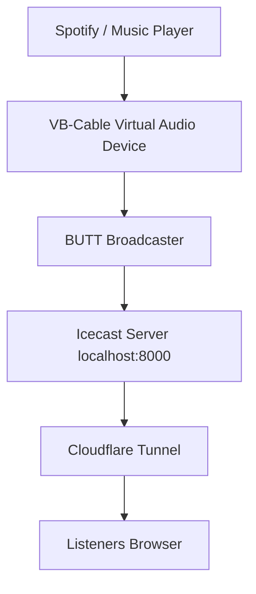

# Simple Internet Radio Setup Guide

## Icecast + BUTT + Cloudflare Tunnel

This guide explains how to create a **simple internet radio stream**
from your computer and share it over the internet.

Pipeline overview:

    Audio Source (Spotify / system audio)
                ↓
    BUTT (Broadcast Using This Tool)
                ↓
    Icecast Server (localhost:8000)
                ↓
    Cloudflare Tunnel (cloudflared)
                ↓
    Public URL 

------------------------------------------------------------------------

# 1. Install Icecast (Streaming Server)

Icecast is the server that distributes your audio stream to listeners.

Download:

https://icecast.org/download/

Choose the **Windows version**.

After installing, locate the Icecast installation folder.\
Inside it you will find the configuration file:

    icecast.xml

------------------------------------------------------------------------

# 2. Configure Icecast

Open:

    icecast.xml

with a text editor.

## Change Authentication Passwords

Find the authentication section:

``` xml
<authentication>
  <source-password>hackme</source-password>
  <admin-password>hackme</admin-password>
</authentication>
```

Change the passwords to something you prefer.

Example:

``` xml
<authentication>
  <source-password>mypassword</source-password>
  <admin-password>adminpassword</admin-password>
</authentication>
```

These passwords will be used by the broadcasting software.

------------------------------------------------------------------------

## Verify Server Port

Find:

``` xml
<port>8000</port>
```

Port **8000** is the default and normally does not need to be changed.

------------------------------------------------------------------------

## Optional: Improve Stream Stability

Find:

``` xml
<burst-size>65536</burst-size>
```

This allows new listeners to buffer some audio and reduces stuttering.

------------------------------------------------------------------------

# 3. Start the Icecast Server

Inside the Icecast installation folder run:

    icecast.bat

A terminal window will open and the server will start.

------------------------------------------------------------------------

## Test Icecast

Open your browser and go to:

    http://localhost:8000

If everything is working you should see the **Icecast Status Page**.

------------------------------------------------------------------------

# 4. Install BUTT (Broadcasting Software)

BUTT stands for **Broadcast Using This Tool**.

It sends audio from your computer to the Icecast server.

Download:

https://danielnoethen.de/butt/

Install and open the program.

------------------------------------------------------------------------

# 5. Configure BUTT

Open:

    Settings

Then configure the following.

------------------------------------------------------------------------

## Main Server Settings

Server Type:

    Icecast

Address:

    localhost

Port:

    8000

Mountpoint:

    /live

Password:

    your source-password from icecast.xml

------------------------------------------------------------------------

## Audio Settings

In:

    Settings → Audio

Recommended values:

Codec:

    MP3

Bitrate:

    160 kbps

Lower bitrate helps with stability when using tunnels.

------------------------------------------------------------------------

## Select Audio Input

BUTT must capture system audio.

Choose one of these devices:

    Stereo Mix
    What U Hear
    Virtual Audio Cable (Recommended)

This allows BUTT to stream music from applications like Spotify.


------------------------------------------------------------------------

# Optional: Using Virtual Audio Cable (Recommended)

Download **VB-Cable (Virtual Audio Cable):**

https://vb-audio.com/Cable/

Download the ZIP file and run:

    VBCABLE_Setup_x64.exe

Click **Install Driver** and restart your computer if prompted.

------------------------------------------------------------------------

## How VB-Cable Works

VB-Cable creates a virtual audio device with two sides:

Playback device:
    CABLE Input

Recording device:
    CABLE Output

Audio sent to **CABLE Input** will appear in **CABLE Output**.

------------------------------------------------------------------------

## Configure Windows Audio

1. Open **Windows Sound Settings**
2. Under **Output device**, select:

    CABLE Input (VB-Audio Virtual Cable)

Now applications like Spotify will play audio into the virtual cable.

------------------------------------------------------------------------

## Configure BUTT

Open:

    Settings → Audio

Set the **Input Device** to:

    CABLE Output (VB-Audio Virtual Cable)

Now BUTT receives the audio from the virtual cable.

------------------------------------------------------------------------

## Result

Your audio pipeline becomes:

    Spotify / Music Player
            ↓
    VB-Cable (virtual audio device)
            ↓
    BUTT
            ↓
    Icecast
            ↓
    Cloudflare Tunnel
            ↓
    Listeners

------------------------------------------------------------------------


# 6. Start Streaming

Click:

    Start Streaming

Now check the Icecast status page again:

    http://localhost:8000

You should see a mountpoint:

    /live

Test the stream locally:

    http://localhost:8000/live

You should hear audio.

------------------------------------------------------------------------

# 7. Install Cloudflare Tunnel

Cloudflare Tunnel makes your local server accessible on the internet
without port forwarding.

Download:

https://github.com/cloudflare/cloudflared/releases/latest/download/cloudflared-windows-amd64.exe

Rename the file:

    cloudflared.exe

Create a folder:

    C:\cloudflared

Move the file there.

------------------------------------------------------------------------

# 8. Start the Tunnel

Open Command Prompt.

Run:

    cd C:\cloudflared

Then:

    cloudflared.exe tunnel --url http://localhost:8000

Cloudflare will generate a public URL.

Example:

    https://example-name.trycloudflare.com

------------------------------------------------------------------------

# 9. Share Your Stream

Your stream URL will be:

    https://example-name.trycloudflare.com/live

Send this link to friends.

They can listen using:

• Web browser\
• VLC media player\
• Internet radio apps

------------------------------------------------------------------------

# Important Notes

### The tunnel must stay running

If you close the terminal running **cloudflared**, the public stream
stops.

### Restart order if something breaks

1.  Start Icecast
2.  Start BUTT streaming
3.  Start Cloudflare Tunnel

------------------------------------------------------------------------

# Optional Tools

Useful software for monitoring streams:

VLC Media Player\
https://www.videolan.org/vlc/

Open the stream and check statistics:

    Tools → Media Information → Statistics

------------------------------------------------------------------------

# Final Result

Once everything is running:

  ## Pipeline Overview


You now have your own **simple internet radio stream**.
